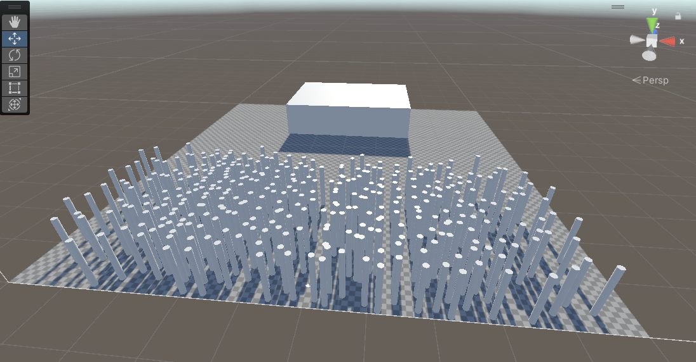
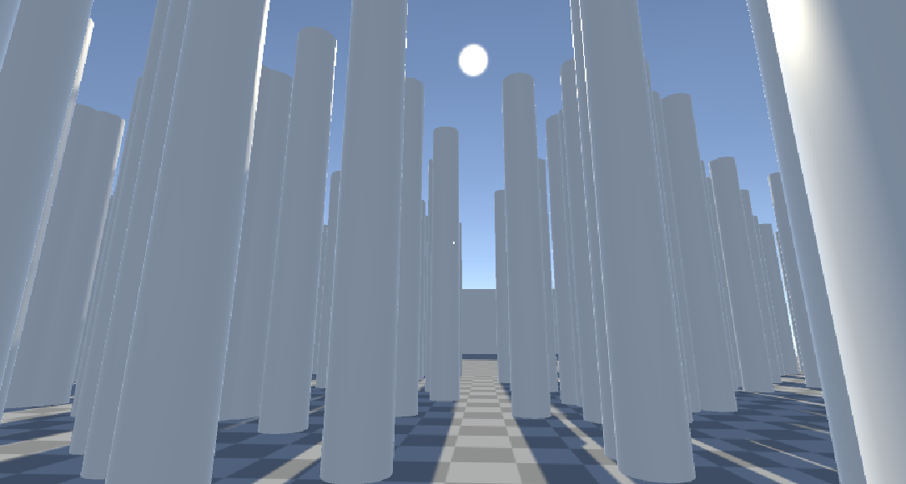
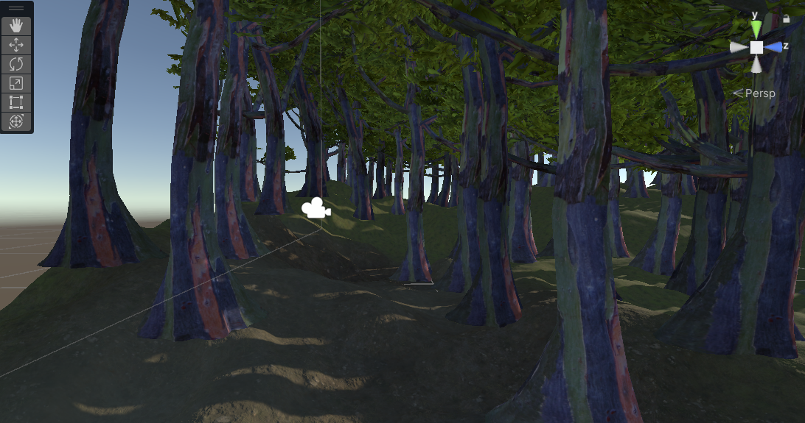

## Concepts

# First Draft of Storyboard

Initially, I was going to be featured much more heavily in the video and my representation of the stress I felt towards RMIT was to be visualised differently. As shown in the first shot, it was supposed to feature me in a high angle to present me as smaller and weaker before being presented with a wide shot of RMIT. The wide shot would be used to make the building feel more intimidating before a close up shot of my leg shaking, something I do a lot subconsciously when nervous. However, upon learning that the video is to be taken on a smartphone whilst featuring me as little as possible, I scrapped the whole storyboard in place for another to fit the project.

# Second Page Concept

After the first page, I was going to begin with shots of me at my train station, but upon realising that I had no idea where to take these shots afterwards and how to connect them to me in any meaningful way, so I scrapped them...

## Storyboard

# First Page

Upon realising that my storyboards lacked a narrative that both showed me as a person with my hobbies, interests and feelings towards entering the program for the first time, I had to rethink the whole video from scratch. Initially I was very frustrated and went through hours without being able to come up with an idea... which ironically was what lead to me finding out what I could make my video about. Finally, I came up with a simple plot of an artist trying to paint a self portrait of themselves whilst struggling to find inspiration. I reflected this in the first page of the storyboard where it illustrates me trying to find inspiration. The shot begins with a high angle close up of a blank page, a symbol meant to visualise my struggles towards the program where I face a lot of blocks trying to find inspiration. Next a reaction shot of me comes up where I put on a very confused, blank sort of facial expression to try and figure out what to do. Throughout the first page of the storyboard, the usage of diegetic and non-diegetic sounds are done to manifest my current frustrations and anxiety that I face with the program. In the next shot, there's a montage of me drawing up new concepts, scrapping them and then throwing more and more paper into the bin. As illustrated in the storyboard, the shots of me drawing will have the camera come closer and closer to symbolise that as an artist, I'm getting closer to finding ideas for a self portrait. This is in direct juxtaposition to the shots where I'm scribbling, crumbling and tearing up pieces of paper as the more frustrated I get, the further the camera is - showing that despite how close I'm getting to finding a solution, each attempt in failure is frustrating me more and more. It ends up to a point where in four mini jump-cuts of the bin I'm just throwing a bunch of crumbled up pieces of paper. This entire sequence of rapid-paced editing and cuts is to demonstrate my short temperedness and how quickly I can give up when faced with a giant wall. Next, I use a POV shot where I'm tapping my pen repeatedly on the table before panning up towards the Myki card. Here my character realises that in order to find inspiration, I will have to explore more about myself. With a quick shot of my hand grabbing the myki card, the non-diegetic sound of white noise adruptly ends before cutting to black. The black screen then dissolves into a medium shot of my tablet with an empty canvas as the camera gradually zooms in. Again, the empty white canvas is to present that although I haven't found any ideas yet for a self portrait, I at least now have a foundation to explore upon compared to when I was just sketching ideas on a book.

# Second Page

After the shot of an empty tablet, there is a rapidly paced montage shot of my clothes and accessories before ending with a shot of me putting on a red jacket from behind. All the shots are presented with extreme close ups to emanate a more personal feeling towards them. I put focus on these objects due to my interest in clothing and fashion as they evoke a sense of confidence in me, which I highlight through extreme close ups and shooting them during the day. After, I have a medium shot of a cat tower and a close up of my cat Cinnamon. I use these shots to demonstrate that one, Cinnamon is my cat as shown by the cat tower and her sleeping on my bed and two to highlight the feeling of companionship supported in the next shot, a birds eye view of her collar and my two shoes together. I put attention to this because it represents how I am as a person, often seeking friendship, bonds, etc in others because at the end of the day I'm a very social person. It's also to highlight the impact Cinnamon has made on me as a person, making me be more aware of my responsibilities whilst also demonstrating how much more life she's added. This is especially strengthened by the next few shots of my friends at a dinner table and beach, where it illustrates my social nature and how deeply I value my friends. In the next shot, I've shot a wide shot of the sun as the sun is a symbolism of joy, which is to elucidate how I feel towards my friends and pet as they've brought a lot of happiness to my life. The four next shots are jump cuts that illustrate me using what I've explored previously to make a sketch. Here the pacing is slowed down for each clip more to represent a calmer atmosphere, showing that the character is taking their time more for the artwork rather than rushing it. The first shot is done during the day as a medium shot as it showcases me drawing my cat. The next jump shot is now of me in the same position and computer watching something on my computer instead of drawing like earlier, symbolising my inability to stay focused and instead procrasinate. This shot is also taken during the afternoon to represent time passing. The next shot is now in the evening, where it illustrates me continuing to draw again to find inspiration before...

# Third Page

...getting distracted once again, this time playing a game at night. This jump cut not only focuses on my escapism to procrasination but also my inability to find an idea that's truly landed yet, as at this point my character is still unsatisfied with the drawing, which leads to the next shots where I still continue to explore about myself to illustrate.