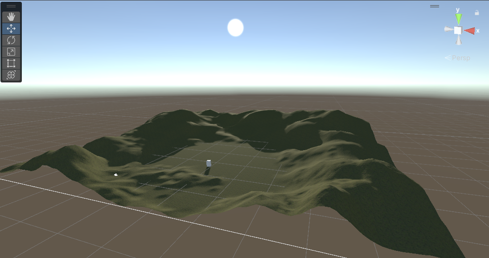
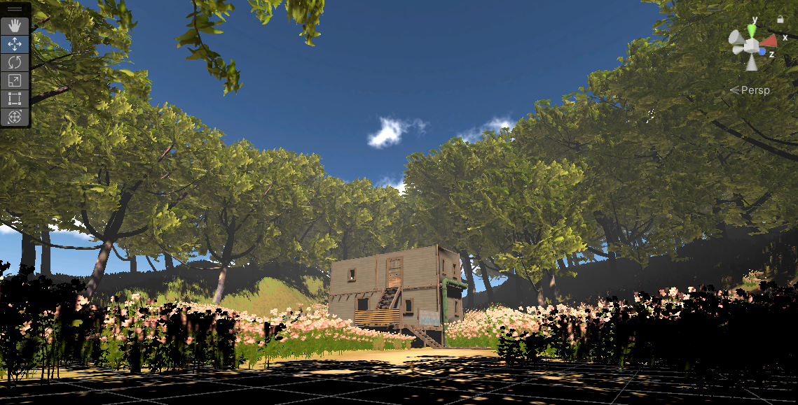

Moved the sun to be behind the house so that it would hint to the player to go forward through a more subtle path.

Started terraforming the area to be more natural. A flat floor doesn't really make sense if it's supposed to be a hill. I've also added more trees out back

Finalised the terraforming and added a 2m cube that would give a sense of scale of how large objects would be to a player.

The trees were being really problematic to deal with. Not only were they all not rooted properly (as seen in this image where they're literally floating above the ground,) but I had no idea how to give meshes to the paint trees function of the terrain. This resulted in the player being able to freely walk through the trees, which I had to resolve through making a new 3D tree with its own mesh and then manually placing them on the terrain. I was able to copy and paste chunks of trees so it wasn't too much of a hassle to deal with.

The shack was originally supposed to be a house that looked nicer on the outside, but because the house assets I had didn't have a proper interior, I decided to go with this shack instead. Although, this does fit the theme a lot more as a dirty, cramped and run down interior environment that's supposed to reflect the ugly nature of my illness and how I feel it has trapped me.
Additionally, the meshes with the house was also a big issue that I had to fix. No matter what I did, the meshes wouldn't work until later when I found out you could make it a rigidbody with kinematic on. This gave the house the mesh it was supposed to have so that players can walk in it and around the room. Additionally, I placed down doors so that it could block players from entering the upper room.

I ended up deciding that it would make more sense visually if the sun was on the other side instead of being behind the house. Not only did it convey that the house was important through literally highlighting it with the use of plane (as the shadows around it signified its importance,) but it also made the flowers and shack appear much more prettier to give off a more homely vibe to the house. This allows for a greater contrast when players first enter inside the house and seeing a way more mundane room that is not similar at all to the outside.