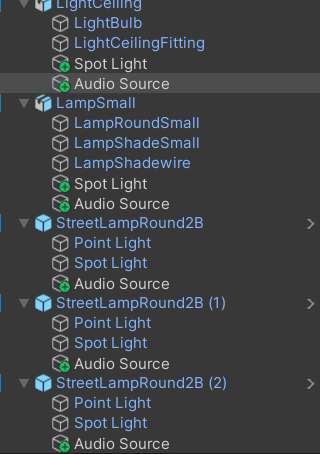

As I was editing the objects to have audio, I realised that the buzzing was playing no matter what position I was in. Even though all sounds were in 3D, the player couldn't hear them no matter how close they got to the lamp. After looking it up, I realised I had to turn spatial blend on to 3D as well, which allowed for the buzzing to be heard when near the lamp.

I also had it so that when the player gets closer to the shack, the sound of the wind blowing changes slightly to a lower pitch to emanate the sound being different when inside. This was done by having two duplicates of the same sound (one for the terrain and one for the shack) where I applied a low pitch filter to the shack and gave it a higher priority.